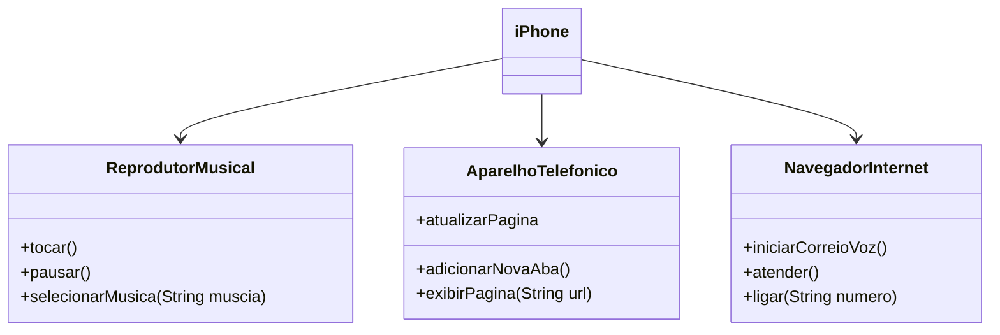

## Desafio Iphone
Realizando o desafio proposto pela DIO durante o Santander Dev Week 2024 na trilha de Java Back End, aplicando os conceitos de UML e Interface.O desafio é modelar e diagramar a representação UML do componente iPhone, abrangendo suas funcionalidades como Reprodutor Musical, Aparelho Telefônico e Navegador na Internet.
### Diagrama UML - Iphone (Mermaid)

